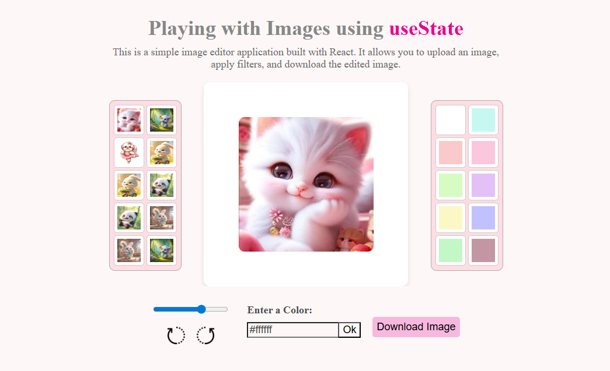

# 🖼️ Playing with Images using React (useState)

A simple **image editor application** built with **React** that allows you to:
- Change images  
- Apply different background colors  
- Rotate the image  
- Resize with a slider  
- Download the edited image **exactly as previewed**  

---

## 🚀 Features
✅ Change image from predefined options  
✅ Select custom background colors  
✅ Resize image using slider  
✅ Rotate left/right in 90° increments  
✅ Download image with all edits applied  

---

## 📸 Preview

---

## 🛠️ Technologies Used
- **React.js** (Frontend)
- **CSS3** (Styling)
- **JavaScript**
- **HTML5 Canvas API** (for download functionality)
